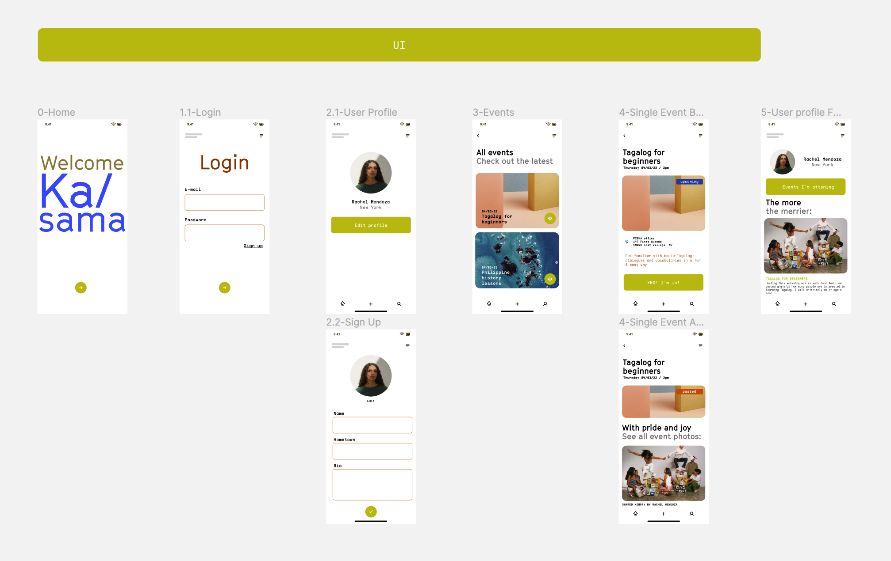
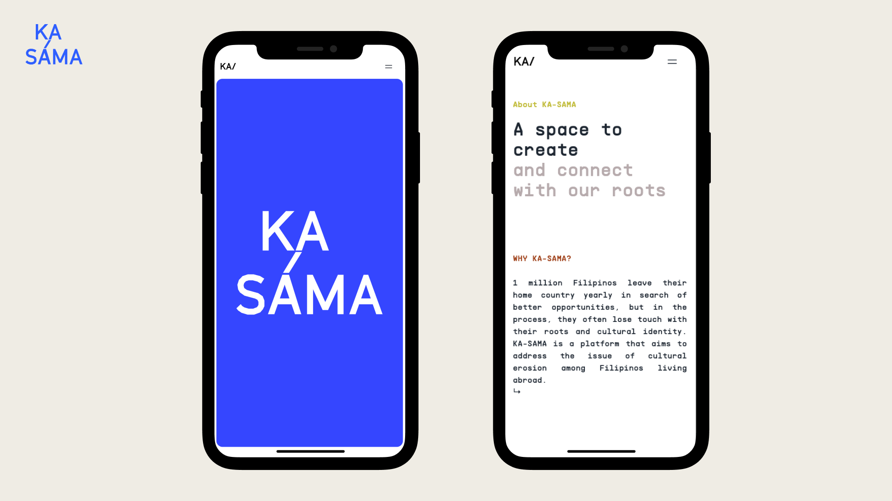
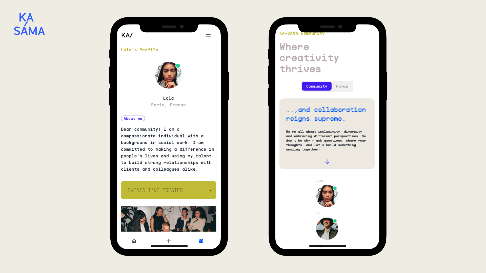
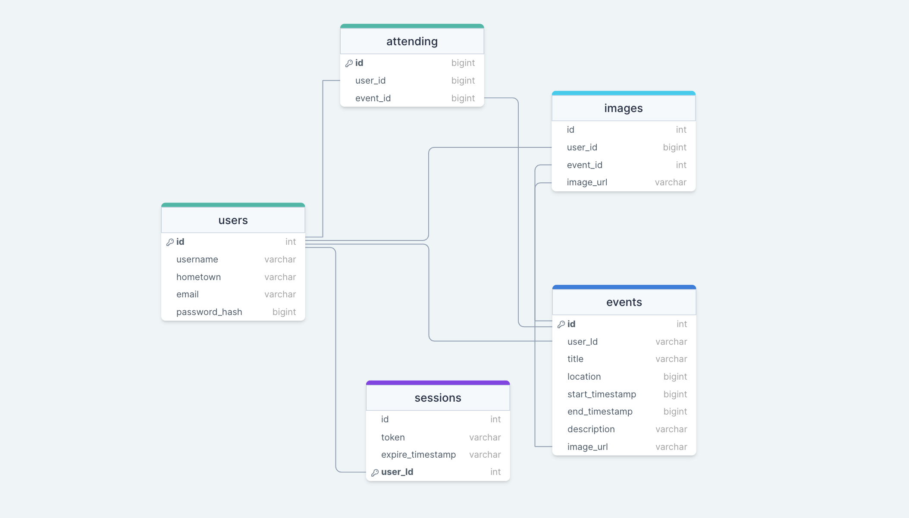

# KA-SAMA - Community building app

## Description

KA-SAMA is a platform that helps Filipinos connect with their heritage and tackle cultural erosion through community building. Its main features include attendance management, event creation, and mobile optimization. Users can easily create and manage events while also tracking attendance through the KA-SAMA mobile app.

With a focus on building community and fostering cultural exchange, KA-SAMA provides a much-needed space for Filipinos to come together, celebrate their cultural heritage, and build a sense of pride and identity.

## Technologies / Languages used

- React - Next.js is built on top of React, a popular front-end JavaScript library. React allows for the creation of reusable components and the efficient updating of the user interface.

- Node.js - Next.js is a server-side rendering framework that runs on top of Node.js. Node.js provides a runtime environment for executing JavaScript code on the server.

- TypeScript - Next.js supports TypeScript, a typed superset of JavaScript that can improve code quality and reduce errors.

- SQL - a query language for APIs that allows for efficient data fetching and reduces the number of requests needed to render a page.

- Playwright - is an open-source Node.js library that allows you to automate user interactions with web browser.

- Cloudinary - Cloudinary is a cloud-based media management platform that offers features such as image and video uploading, resizing, cropping, optimization, and delivery, as well as AI-powered analysis. It simplifies the process of managing media assets for web and mobile applications using a simple API, improving performance and user experience.

- Openai API - OpenAI API is a platform that enables developers to integrate OpenAI's pre-trained natural language processing models into their own applications. It allows developers to build intelligent applications that understand, generate, and respond to human language, with simple API calls and comprehensive documentation.

## Protoyping / UI / UX



Click on the [link](https://www.figma.com/file/Ypz6BAuMq7hg2oBMHHKS0w/KA-SAMA---UI%2FUX?node-id=1%3A2&t=h2JBBZv9H0eYTUQY-1) to view look & feel, wireframes and UI/UX planning.

## Screenshots

#### Home & About



#### Events


#### User profile & community



## Database schema



[Link to drawSQL] (https://drawsql.app/teams/katja-sabando/diagrams/final-project-ka-sama)

## Setup instructions

Clone the project on your local machine (run each line individually):

```
git clone <url>
cd <repo name>
yarn
```

Connect to default database as admin:

```
On macOS
psql postgres
```

Set up the database:

```
CREATE DATABASE <database name>;
CREATE USER <user name> WITH ENCRYPTED PASSWORD <user password>;
GRANT ALL PRIVILEGES ON DATABASE <database name> TO <user name>;
```

After queries are successfully ran, quit psql and connect to the database
\q
On Windows & macOS

```
psql -U <user name> <database name>
```

In the repository's directory, run migrations using ley:

```
yarn migrate up
```

Create a .env file:
Open the project in your code editor

Copy the content of the .env.example file into the .env file
Replace xxxxxxxx with the access information
add .env file to .gitignore

Start deployment server:

```
yarn dev
```

## Deployment instructions

Sign up on Fly.io
On the Fly.io Tokens page, generate a new Fly.io access token named GitHub Actions Deploy Token and copy it from the text box that appears - it will only be shown once

In GitHub repo under Settings → Secrets → Actions, click the New repository secret button at the top right of the page and create a new token with the name FLY_API_TOKEN and the token copied as the secret
On the command line, open the Fly.io login page in my browser using the following command:

```
flyctl auth login
```

Enter credentials in the browser window that appears and then click on the link Try Fly.io for free. Switch back to the terminal - it should now show a message like successfully logged in as <your email>.

Create an app, specifying the name using only lowercase letters and dashes:

```
flyctl apps create --name <app name>
```

Create the Fly.io config files as demonstrated in the lecture (also available in the Next.js example repo)

Change your database/connect.ts as in the lecture: only run config() from dotenv-safe if the FLY_IO environment variable is not set
Change your next.config.js as in the lecture: disable linting and type checking on build, since we do this earlier in the GitHub Actions deploy process

Add database credentials using Fly.io secrets, randomly generating the database name, username and password:

```
flyctl secrets set PGHOST=localhost PGDATABASE=upleveled$(openssl rand -hex 16) PGUSERNAME=upleveled$(openssl rand -hex 16) PGPASSWORD=$(openssl rand -base64 32)
```

If your app needs any additional environment variables such as API keys, also add them to the secrets using the following pattern:

```
flyctl secrets set <secret name>=<secret value>
```

The Next.js documentation mentions exposing variables to the browser using variables prefixed with NEXT*PUBLIC*. Instead of using environment variables for this, we recommend declaring a JavaScript variable in your code because this information is not secret - it will be exposed to the browser. If you absolutely need to set a NEXT*PUBLIC* environment variable, you can add it to your .env.production file.

Create a 1GB volume for the PostgreSQL database in the Frankfurt region:

```
flyctl volumes create postgres --size 1 --region fra
```

Deploy the first version of the app:

```
flyctl deploy
```

You may receive a failed to fetch an image or build from source error during deployment:

Error failed to fetch an image or build from source: error building: executor failed running [/bin/sh -c yarn build]: exit code: 1

Deploys may fail for a number of reasons, to find the real error message you will need to scroll up in the logs and find the first line that looks like an error.
